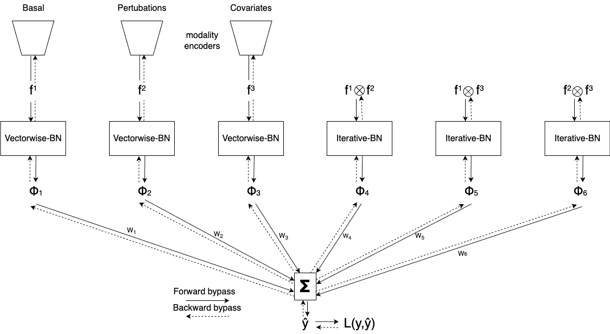
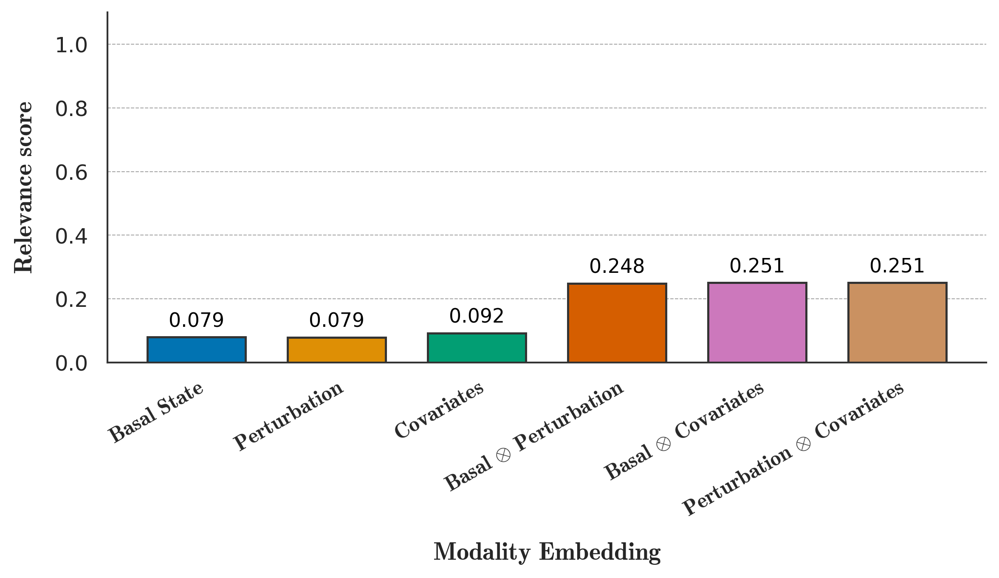

# Intense-CPA — Compositional Perturbation Autoencoder with Interpretable Tensor Fusion

[](pyproject.toml)
[](https://pytorch.org)
[](https://github.com/theislab/cpa)
[](LICENSE)

**Intense-CPA** extends the [Compositional Perturbation Autoencoder (CPA)](https://github.com/theislab/cpa) so that the way a cell's *basal state*, the *perturbation* it receives and its *covariates* (cell type, species, batch…) are combined is **learned, non-linear and interpretable**, instead of a fixed sum of embeddings.

It was developed as my Master's thesis *"Deep Representation Learning for Single-Cell Data"* (RPTU Kaiserslautern-Landau, 2026, supervised by Prof. Dr. Marius Kloft and Andriy Balinskyy). The full thesis is available on request; the abstract and main findings are summarised below.

---

## Why?

CPA learns disentangled latent factors for single-cell perturbation data and composes them additively:

```
z = z_basal + z_perturbation + z_covariates
```

That linear composition is easy to interpret, but it pushes every interaction between the factors into the decoder, where it is neither explicit nor measurable. When a drug acts differently depending on the cell line, or a dose response depends on the species, CPA has no dedicated place to represent it, and no way to tell you *how much* that interaction mattered.

Intense-CPA replaces the sum with an [Interpretable Tensor Fusion (InTense)](https://arxiv.org/abs/2405.04671) module. The three embeddings are treated as modalities; their pairwise (and optionally three-way) **tensor products** are computed, normalised, and fused by a multiple-kernel-style linear layer whose weights yield a **relevance score** for every main effect and every interaction:

```
z = Σ_I  √β_I · ⟨ w_I , f̃_I ⟩      I ∈ { {basal}, {pert}, {cov}, {basal⊗pert}, {basal⊗cov}, {pert⊗cov}, [{basal⊗pert⊗cov}] }
```

<p align="center">
  
  <br><em>The InTense module that replaces CPA's additive composition. Solid arrows: forward pass; dashed: backward pass.</em>
</p>

What you get on top of CPA:

* **Explicit interactions** between basal state, perturbation and covariates (order 1, 2 or 3).
* **Relevance scores** `β_I` that quantify how much each embedding and each interaction contributes to the fused representation — a direct handle for biological interpretation.
* Everything CPA already does: out-of-distribution prediction of unseen perturbation/dose/cell-type combinations, dose-response curves, batch correction, external drug embeddings.

---

## Results in brief

Intense-CPA and CPA were compared on the five benchmark datasets of the CPA paper, each trained with five seeds after a 100-trial hyper-parameter search, using R² of mean / variance / log-fold-change on all HVGs and on the top 10/20/50 DEGs, in-distribution and out-of-distribution.

| Scenario | Dataset | Outcome |
|---|---|---|
| Combinatorial drug perturbations (OOD drug pairs) | Combo-sciPlex (A549) | **Intense-CPA better** |
| Unseen combinatorial CRISPR perturbations | Norman et al. 2019 (K562) | **Intense-CPA better** |
| Unseen doses across cell lines | sciPlex 3 (A549, K562, MCF7) | mixed |
| Cross-species / time-point transfer | Hagai et al. 2018 (rat, rabbit, pig phagocytes) | mixed |
| Unseen cell type, binary perturbation | Kang et al. 2018 (PBMC, IFN-β) | CPA better |

* Intense-CPA produced cleaner disentangled basal latent spaces in 3 of 5 datasets and outperformed CPA in both single-cell-line experiments.
* Relevance scores are informative: on sciPlex 3, for example, main effects each receive ≈0.08 while the three pairwise interactions carry ≈0.25 each — the response is dominated by *interactions*, in particular those involving cell-line identity.
* Ablations show that interaction order 3 rarely helps, and that InTense's vector-wise / iterative batch-norm can hurt on sparse multi-cell-type data (removing it improved Kang and cross-species) — a concrete direction for future work.

<p align="center">
  
  <br><em>Relevance scores on sciPlex 3: pairwise interactions dominate the prediction.</em>
</p>

---

## Installation

```bash
git clone https://github.com/JerielMbiedou/IntenseCPA.git
cd IntenseCPA
conda create -n intense-cpa python=3.10 && conda activate intense-cpa
pip install -e .
```

The package keeps the import name `cpa`, so existing CPA code and the original tutorials run unchanged. Requirements are pinned in `pyproject.toml` (PyTorch ≤ 2.0.1, scvi-tools < 1.0, Ray Tune 2.9). A CUDA GPU is strongly recommended.

---

## Quick start

Data preparation is identical to CPA (raw counts in `adata.layers['counts']`, perturbation / dose / covariate columns in `adata.obs`; see the [pre-processing recipe](#pre-processing-a-custom-dataset) below).

```python
import cpa, scanpy as sc

adata = sc.read_h5ad("kang_normalized_hvg.h5ad")
adata.X = adata.layers["counts"].copy()

cpa.CPA.setup_anndata(
    adata,
    perturbation_key="condition",
    control_group="ctrl",
    dosage_key="dose",
    categorical_covariate_keys=["cell_type"],
    is_count_data=True,
    max_comb_len=1,
)

model_params = {
    "n_latent": 64,
    "recon_loss": "nb",
    "doser_type": "linear",
    "n_hidden_encoder": 128, "n_layers_encoder": 2,
    "n_hidden_decoder": 512, "n_layers_decoder": 2,
    "use_batch_norm_encoder": True, "use_layer_norm_decoder": True,
    "dropout_rate_decoder": 0.1,
    "variational": False,
    "seed": 0,
    # --- Intense-CPA specific ---
    "use_intense": True,        # False -> plain CPA
    "interaction_order": 2,     # 1 = main effects only, 2 = + pairwise, 3 = + three-way
    "intense_p": 2,             # p-norm used for the fusion weights / relevance scores
    "intense_reg_rate": 0.05,   # strength of the InTense regulariser added to the loss
    "tf_latent_dim": 8,         # project embeddings to this dim before the tensor product
                                # (None = use n_latent; keeps d^k memory in check)
}

model = cpa.CPA(adata=adata, split_key="split", train_split="train",
                valid_split="valid", test_split="ood", **model_params)

model.train(max_epochs=500, use_gpu=True, batch_size=512, early_stopping_patience=10,
            plan_kwargs=dict(n_epochs_adv_warmup=3, n_epochs_pretrain_ae=3, adv_steps=2,
                             reg_adv=1.4, pen_adv=12.8, lr=3e-3, adv_lr=1.5e-4, step_size_lr=25))
```

### Reading the relevance scores

```python
scores = model.module.intense_fusion.get_relevance_score()
# {'z1': 0.08, 'z2': 0.08, 'z3': 0.09, 'z12': 0.25, 'z13': 0.25, 'z23': 0.25}
#  z1 = basal, z2 = perturbation, z3 = covariates, zij = interaction i⊗j
```

Scores sum to one; they are also logged each epoch during training (`intense_reg` and the per-term scores appear in the Lightning logs).

### Intense-CPA hyper-parameters

| Name | Default | Meaning |
|---|---|---|
| `use_intense` | `False` | Switch the InTense fusion on (otherwise the model is vanilla CPA). |
| `interaction_order` | `3` | Highest interaction order fused: 1 (singles), 2 (+ pairs), 3 (+ triple). Order 2 was best in almost every experiment. |
| `intense_p` | `1` | *p* of the ℓ<sub>p</sub>-style block norm used for the regulariser and the relevance scores. |
| `intense_reg_rate` | `0.01` | Weight Λ of the InTense regulariser added to the reconstruction loss. |
| `tf_latent_dim` | `None` | Dimension to which the three embeddings are projected before the tensor product (`d²`, `d³` growth). |

Note that Intense-CPA is trained with **SGD** for the fusion module (no weight decay) while the rest of the network keeps CPA's optimiser — Adam's adaptive step sizes would distort the fusion weights and therefore the relevance scores.

---

## Reproducing the thesis experiments

All experiment code lives in the repository; paths are resolved from two environment variables so nothing is hard-coded:

```bash
export INTENSE_CPA_ROOT=/path/to/IntenseCPA        # where datasets/ lives (default: cwd)
export INTENSE_CPA_SCRATCH=/path/to/fast/scratch    # runs, checkpoints, Ray Tune logs (default: $INTENSE_CPA_ROOT/runs)
```

| Step | Where |
|---|---|
| Hyper-parameter search (Ray Tune, 100 trials, one script per dataset) | `examples/*_tune_script.py`, Slurm wrappers `examples/finetune*.sbatch` |
| Extract the best configuration from a Ray run | `docs/tutorials/aggregate_results.py` |
| Train / evaluate one model (CPA or Intense-CPA) for one seed | `docs/tutorials/run_experiment*.py --use_intense {0,1} --seed N` |
| Multi-seed averaging and Markdown reports | `results/aggregate_result_*.py`, `results/report_*.py`, `results/compare_cpa_models.py` |
| Notebooks (Kang, Norman, combo-sciPlex ± RDKit, sciPlex 3, cross-species) | `docs/tutorials/*.ipynb` |
| Best configurations used in the thesis | `configs/` |

Datasets are the pre-processed `.h5ad` files released with the CPA paper (downloaded automatically with `gdown` on first run). Pre-trained checkpoints from the thesis can be shared on request.

---

## Pre-processing a custom dataset

A dataset for CPA / Intense-CPA is a `scanpy` `AnnData` with raw counts and metadata:

1. `adata.obs` must contain the perturbation column and a dosage column (for binary perturbations such as CRISPR or disease state, use a dummy `1.0` per perturbation); cell type and batch columns are optional covariates.
2. `sc.pp.filter_cells(adata, min_counts=100)` (optionally `sc.pp.filter_genes`).
3. `adata.layers['counts'] = adata.X.copy()`
4. `sc.pp.normalize_total(adata, target_sum=1e4, exclude_highly_expressed=True)`; `sc.pp.log1p(adata)`
5. Select HVGs — `sc.pp.highly_variable_genes(adata, n_top_genes=5000, subset=True)`, or `scib.pp.hvg_batch` for multi-batch data.
6. `adata.write_h5ad(...)`

---

## Repository layout

```
cpa/
  _intense.py        InTense module: tensor fusion, VBN / iterative BN, MKL fusion layer, relevance scores
  _normalization_module.py
  _module.py         CPA module with the optional InTense composition (use_intense=True)
  _task.py           training loop: InTense regulariser, SGD param group, score logging
  _model.py, _api.py, _data.py, _trainer.py, _tuner.py, _metrics.py, _plotting.py, _utils.py
examples/            Ray Tune search scripts + Slurm wrappers, one per dataset
docs/tutorials/      notebooks, single-run experiment scripts, report generators
results/             aggregation / comparison scripts
configs/             best hyper-parameter sets found for the thesis
tests/
```

Branches: `main` holds the thesis code. `low-rank-fusion` is an experimental branch replacing the full tensor product (memory `d^k`) by a low-rank factorisation — one of the future-work items of the thesis; it is not used in the reported results.

---

## Relationship to CPA, and citing

This repository is a fork of [theislab/cpa](https://github.com/theislab/cpa) (BSD-3-Clause, © Lotfollahi & Theis lab), which it keeps as its backbone — please cite CPA if you use this code:

```bibtex
@article{lotfollahi2023predicting,
  title   = {Predicting cellular responses to complex perturbations in high-throughput screens},
  author  = {Lotfollahi, Mohammad and Klimovskaia Susmelj, Anna and De Donno, Carlo and Hetzel, Leon and Ji, Yuge and Ibarra, Ignacio L and Srivatsan, Sanjay R and Naghipourfar, Mohsen and Daza, Riza M and Martin, Beth and others},
  journal = {Molecular Systems Biology},
  pages   = {e11517},
  year    = {2023}
}
```

The fusion module implements Interpretable Tensor Fusion:

```bibtex
@inproceedings{varshneya2024intense,
  title     = {Interpretable Tensor Fusion},
  author    = {Varshneya, Saurabh and Ledent, Antoine and Liznerski, Philipp and Balinskyy, Andriy and Mehta, Purvanshi and Mustafa, Waleed and Kloft, Marius},
  booktitle = {Proceedings of the Thirty-Third International Joint Conference on Artificial Intelligence (IJCAI)},
  pages     = {5037--5045},
  year      = {2024},
  doi       = {10.24963/ijcai.2024/557}
}
```

And this work:

```bibtex
@mastersthesis{mbiedou2026intensecpa,
  title  = {Deep Representation Learning for Single-Cell Data},
  author = {Mbiedou, Jeriel Nkouadja},
  school = {RPTU Kaiserslautern-Landau, Department of Computer Science},
  year   = {2026}
}
```

Questions or ideas? Open an [issue](https://github.com/JerielMbiedou/IntenseCPA/issues) or write to jerielmbiedou86@gmail.com.
